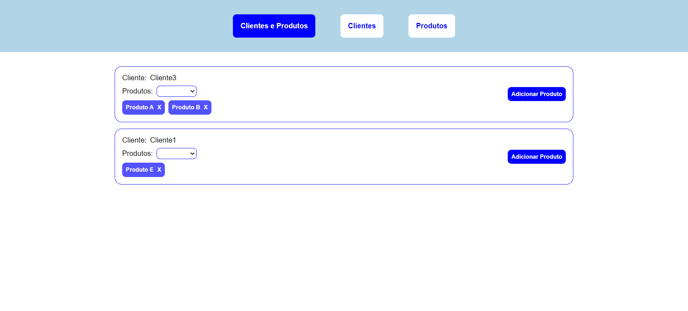
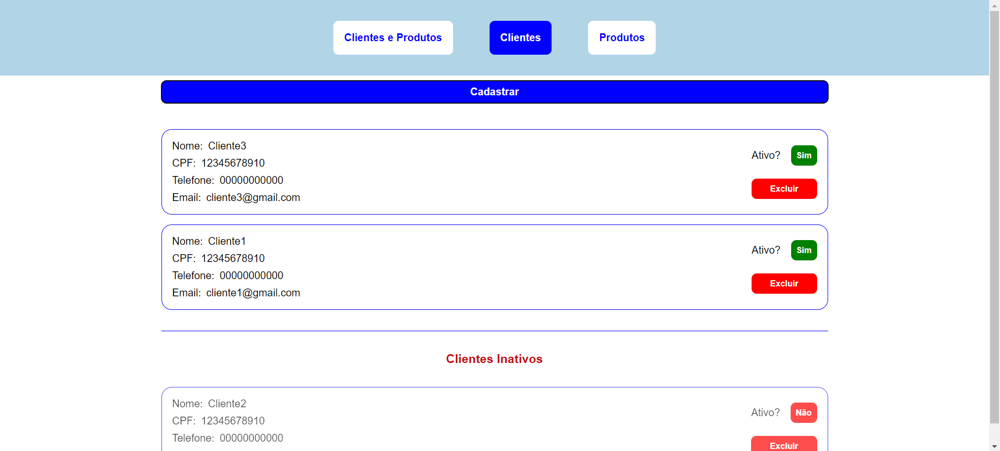
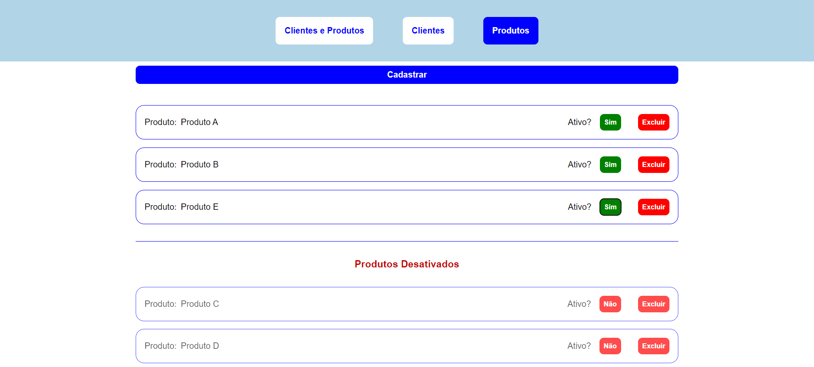

# Sobre o projeto

O projeto tem como objetivo realizar a associação de clientes com seus produtos. Para isso, foi criado três telas, cada uma sendo acessada por botões encontrados na parte superior do site. São eles:

*Clientes e Produtos:

Nesta tela que são realizados as associações de clientes com os produtos. Para realizar essa associação, o usuário deve selecionar o produto na caixa de seleção do campo esquerdo do card e clicar no botão "Adicionar Produto".
Obs.: A associação só é possível caso exista no mínimo um cliente e um produto cadastrado.

*Clientes:

Nesta tela é realizado o cadastro de clientes, no botão "Cadastrar", e a listagem de clientes ativos e inativos.
Obs.: Quando é realizado o cadastro de um cliente, ele surge na lista como cliente ativo, sendo possível alterar esse status o que gera uma segunda lista de clientes inativos.

*Produtos:

Nesta tela é realizado o cadastro de produtos, no botão "Cadastrar", e a listagem de produtos ativos e inativos.
Obs.: Seguindo a mesma lógica da tela de clientes, quando é realizado o cadastro de um novo produto, ele surge na lista como produto ativo, sendo possível alterar esse status o que gera uma segunda lista de produtos inativos.


## Recommended IDE Setup

[VSCode](https://code.visualstudio.com/) + [Volar](https://marketplace.visualstudio.com/items?itemName=Vue.volar) (and disable Vetur) + [TypeScript Vue Plugin (Volar)](https://marketplace.visualstudio.com/items?itemName=Vue.vscode-typescript-vue-plugin).

## Customize configuration

See [Vite Configuration Reference](https://vitejs.dev/config/).

## Project Setup

```sh
npm install
```

### Compile and Hot-Reload for Development

```sh
npm run dev
```

### Compile and Minify for Production

```sh
npm run build
```
